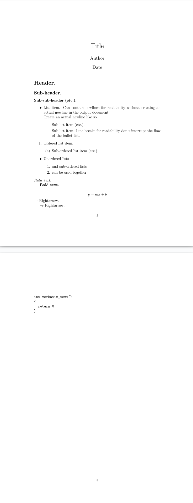

# Sparkdown

A new markup/markdown language for quickly taking notes.

Sparkdown is a C++ library and command-line executable that provides a simple, powerful, and easy-to-use API
for transpiling notes into LaTeX code, which can then be compiled into a PDF.

## Motivation:

Is LaTeX too verbose? Does markdown lack features?

Enter sparkdown, the new note-taking language.
Sparkdown is the perfect blend of simple, easy, and feature-rich.

## Features:

- Nested ordered and unordered lists.

- Math mode: display your formulas neatly!

- Verbatim mode: display code in a monospace text, with special characters and custom indentation supported.

- Italic and bold text.

- Arrows!

- All LaTeX code is valid in sparkdown.

## Usage:

    Usage: sparkdown <file> [OPTIONS]
      Options:
        -h, --help: 	    Print this help message.
        -v, --version:	  Print version information.
        -o, --output:	    Output file.
        -w, --overwrite:	Overwrite output file if it exists.

## Syntax:

    $title: Title
    $author: Author
    $date: Date

    =============  % Border between optional metadata and content.

    # Header.

    ## Sub-header.

    ### Sub-sub-header (etc.).

    % Comment.

    * List item.
      Can contain newlines for readability without
      creating an actual newline in the output document.
      \\ Create an actual newline like so.
      * Sub-list item (etc.).

      - Sub-list item.
        Line breaks for readability don't interrupt the flow
        of the bullet list.


    1. Ordered list item.
      1. Sub-ordered list item (etc.).

    * Unordered lists
      1. and sub-ordered lists
      2. can be used together.

    \noindent *Italic text.*  % Notice how we can use LaTeX commands.

    \indent **Bold text.**

    \[
      y = mx + b
    \]

    \noindent -> Rightarrow.

    \indent --> Rightarrow.

    ```
    int verbatim_text()
    {
      return 0;
    }
    ```

## Output:


