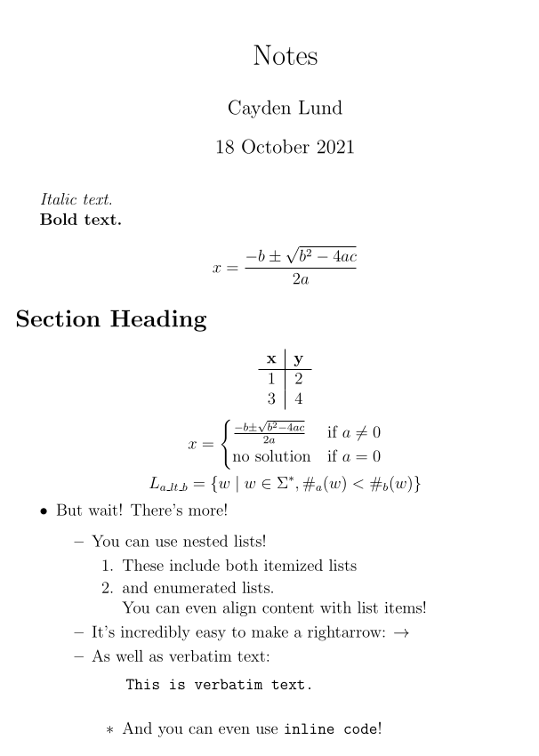

## Create a Sparkdown file

Create a file; we'll use it as our notebook.

The name is not important, though it's customary to use the extension `_`.

For the purposes of this example, we'll refer to our file as `Notes._`.

## Write the header of the document

```md title="Notes._"
$author: Cayden Lund
$title: Notes
$date: 18 October 2021
% The header contains some metadata overrides for our document.
% Overriding the metadata is possible by using the `$` character.

% Notice that we can also use the `%` character
% to write comments that will be ignored by the compiler!
======
```

## Write some markdown text

```md title="Notes._"
$author: Cayden Lund
$title: Notes
$date: 18 October 2021
% The header contains some metadata overrides for our document.
% Overriding the metadata is possible by using the `$` character.

% Notice that we can also use the `%` character
% to write comments that will be ignored by the compiler!
======

<!-- highlight-start -->
*Italic text.*

**Bold text.**

# Section Heading
<!-- highlight-end -->
```

This is enough for the Sparkdown compiler to recognize your intent and return valid LaTeX code.

## Add some LaTeX text

```md title="Notes._"
$author: Cayden Lund
$title: Notes
$date: 18 October 2021
% The header contains some metadata overrides for our document.
% Overriding the metadata is possible by using the `$` character.

% Notice that we can also use the `%` character
% to write comments that will be ignored by the compiler!
======

*Italic text.*

**Bold text.**

<!-- highlight-start -->
\[
    x = \frac{-b \pm \sqrt{b^2-4ac}}{2a}
\]
<!-- highlight-end -->

# Section Heading
```

This is just an illustration that both languages are supported out-of-the-box.

Let's add some more advanced LaTeX code.

```md title="Notes._"
$author: Cayden Lund
$title: Notes
$date: 18 October 2021
% The header contains some metadata overrides for our document.
% Overriding the metadata is possible by using the `$` character.

% Notice that we can also use the `%` character
% to write comments that will be ignored by the compiler!
======

*Italic text.*

**Bold text.**

\[
    x = \frac{-b \pm \sqrt{b^2-4ac}}{2a}
\]

# Section Heading

<!-- highlight-start -->
% How about a table?
\begin{center}
    \begin{tabular}{c|c}
        **x** & **y** \\    % Did you catch that? We can use markdown inside of LaTeX!
        \hline
        1 & 2 \\
        3 & 4
    \end{tabular}
\end{center}

% And why not some fancy math?
\[
    x =
    \begin{cases}
        \frac{-b \pm \sqrt{b^2-4ac}}{2a} & \text{if } a \neq 0 \\
        \text{no solution} & \text{if } a = 0
    \end{cases}
\]
\[
    L_{a\_lt\_b} = \{ w \mid w \in \Sigma^*, \#_a(w) < \#_b(w) \}
\]
<!-- highlight-end -->
```
LaTeX is quite verbose, but it's also very powerful. This is why Sparkdown was created:
enjoy the power of LaTeX using simple and intuitive syntax.

## Add some Sparkdown-specific text

Sparkdown comes with a few special utilities that make it easier to take notes quickly.

```md title="Notes._"
$author: Cayden Lund
$title: Notes
$date: 18 October 2021
% The header contains some metadata overrides for our document.
% Overriding the metadata is possible by using the `$` character.

% Notice that we can also use the `%` character
% to write comments that will be ignored by the compiler!
======

*Italic text.*

**Bold text.**

\[
    x = \frac{-b \pm \sqrt{b^2-4ac}}{2a}
\]

# Section Heading

% How about a table?
\begin{center}
    \begin{tabular}{c|c}
        **x** & **y** \\    % Did you catch that? We can use markdown inside of LaTeX!
        \hline
        1 & 2 \\
        3 & 4
    \end{tabular}
\end{center}

% And why not some fancy math?
\[
    x =
    \begin{cases}
        \frac{-b \pm \sqrt{b^2-4ac}}{2a} & \text{if } a \neq 0 \\
        \text{no solution} & \text{if } a = 0
    \end{cases}
\]
\[
    L_{a\_lt\_b} = \{ w \mid w \in \Sigma^*, \#_a(w) < \#_b(w) \}
\]

<!-- highlight-start -->
* But wait! There's more!
  * You can use nested lists!
    1. These include both itemized lists
    2. and enumerated lists.
      \\ You can even align content with list items!
  * It's incredibly easy to make a rightarrow: ->
  * As well as verbatim text:
    ```
    This is verbatim text.
    ```
    * And you can even use |inline code|!
<!-- highlight-end -->
```

## Process the file

We use our newly-built binary executable to parse the file:

```bash
$ sparkdown Notes._ -o Notes.tex
# The `-o` option tells the compiler the name of the file to create.
```

We now have a new file, `Notes.tex`, that is valid LaTeX code!

If you want to read it, this is what it looks like:

```latex title="Notes.tex"
\title{Notes}
\author{Cayden Lund}
\date{18 October 2021}

\documentclass[12pt, letterpaper]{article}


\usepackage{graphicx}
\graphicspath{{.}}

\usepackage[utf8]{inputenc}

\usepackage{tabularx}

\usepackage{amsmath}


\begin{document}


\maketitle


\textit{Italic text.}

\textbf{Bold text.}

\[
    x = \frac{-b \pm \sqrt{b^2-4ac}}{2a}
\]

\section*{Section Heading}

% How about a table?
\begin{center}
    \begin{tabular}{c|c}
        \textbf{x} & \textbf{y} \\    % Did you catch that? We can use markdown inside of LaTeX!
        \hline
        1 & 2 \\
        3 & 4
    \end{tabular}
\end{center}

% And why not some fancy math?
\[
    x =
    \begin{cases}
        \frac{-b \pm \sqrt{b^2-4ac}}{2a} & \text{if } a \neq 0 \\
        \text{no solution} & \text{if } a = 0
    \end{cases}
\]
\[
    L_{a\_lt\_b} = \{ w \mid w \in \Sigma^*, \#_a(w) < \#_b(w) \}
\]

\begin{itemize}
    \item But wait! There's more!
    \begin{itemize}
        \item You can use nested lists!
        \begin{enumerate}
            \item These include both itemized lists
            \item and enumerated lists.
                  \\ You can even align content with list items!
        \end{enumerate}
        \item It's incredibly easy to make a rightarrow: $\rightarrow$
        \item As well as verbatim text:
    \begin{verbatim}
    This is verbatim text.
            \end{verbatim}
        \begin{itemize}
            \item And you can even use \verb|inline code|!
            
        \end{itemize}
    \end{itemize}
\end{itemize}


\end{document}
```

## Compile the PDF

If you have `pdflatex` installed, it's easy to compile the LaTeX into a PDF from there:

```bash
$ pdflatex Notes.tex
# Compiles the file and creates Notes.pdf.
```

Rendered output:



This does of course rely on a LaTeX installation. Follow the [LaTeX installation instructions](https://www.latex-project.org/get/)
to get LaTeX and its necessary dependencies.
