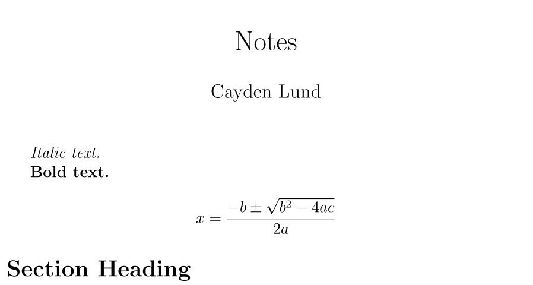

## Create a Sparkdown file

Create a file; we'll use it as our notebook.

The name is not important, though it's customary to use the extension `_`.

For the purposes of this example, we'll refer to our file as `Notes._`.

## Write the header of the document

```markdown title="Notes._" {1-3}
$author: Cayden Lund
$title: Notes
======
```

## Write some markdown text

```markdown title="Notes._" {5-9}
$author: Cayden Lund
$title: Notes
======

*Italic text.*

**Bold text.**

# Section Heading
```

This is enough for the Sparkdown compiler to recognize your intent and return valid LaTeX code.

## Add some LaTeX text

```markdown title="Notes._" {9-11}
$author: Cayden Lund
$title: Notes
======

*Italic text.*

**Bold text.**

\[
    x = \frac{-b \pm \sqrt{b^2-4ac}}{2a}
\]

# Section Heading
```

This is just an illustration that both languages are supported out-of-the-box.

## Process the file

We use our newly-built binary executable to parse the file:

```bash
$ sparkdown Notes._ -o Notes.tex
# The `-o` option tells the compiler the name of the file to create.
```

We now have a new file, `Notes.tex`, that is valid LaTeX code!

If you want to read it, this is what it looks like:

```latex title="Notes.tex"
\title{Notes}
\author{Cayden Lund}
\date{}

\documentclass[12pt, letterpaper]{article}


\usepackage{graphicx}
\graphicspath{{.}}

\usepackage[utf8]{inputenc}

\usepackage{tabularx}

\usepackage{amsmath}


\begin{document}


\maketitle


\textit{Italic text.}

\textbf{Bold text.}

\[
    x = \frac{-b \pm \sqrt{b^2-4ac}}{2a}
\]


\end{document}
```

## Compile the PDF

If you have `pdflatex` installed, it's easy to compile the LaTeX into a PDF from there:

```bash
$ pdflatex Notes.tex
# Compiles the file and creates Notes.pdf.
```

Rendered output:



This does of course rely on a LaTeX installation. Follow the [LaTeX installation instructions](https://www.latex-project.org/get/)
to get LaTeX and its necessary dependencies.
